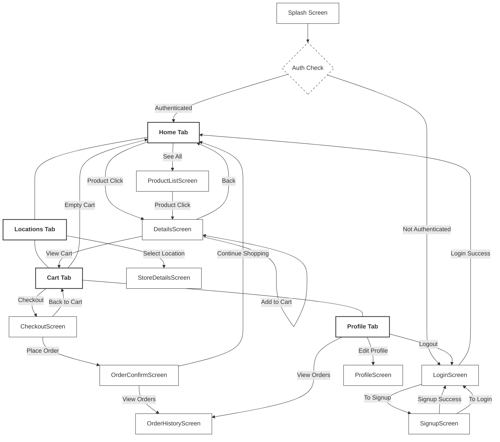

# Mobile-Computing-Project

## Expo Link: SOON


### Project Colors
```
  primary: "#03A791",
  secondary: "#FFFFFF",
  neutral: "gray",
  neutral2: "#F2F3F2",
  text: "#333333",
  error: "#FF3B30",
  success: "#4CD964",
  warning: "#FF9500",
  shadow: "rgba(0, 0, 0, 0.1)",
```
### Project Fonts
```
Splash screen: Delius-Regular.ttf
Splash screen: Pacifico-Regular.ttf
Titles: Lato-Bold.ttf
Regular text: Lato-Regular.ttf
```

### Interactions:


